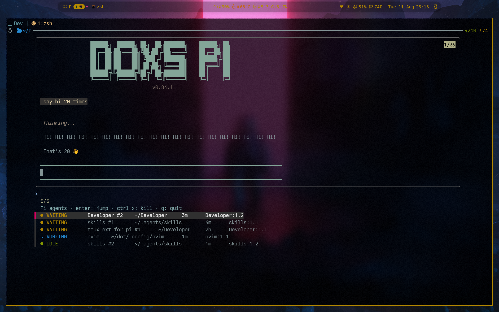

# tmux-pi-session-manager

Manage, discover, monitor, and jump between **Pi coding agents** running inside
tmux with per-directory multi-agent support, event-driven status tracking,
and deduplicated desktop notifications.



Built for [Pi](https://github.com/earendil-works/pi) (`pi` coding agent) on
Linux/Wayland with tmux + fzf. Conceptually inspired by
[craftzdog/tmux-claude-session-manager](https://github.com/craftzdog/tmux-claude-session-manager),
but implemented against **Pi-native extension APIs** — no terminal-output
parsing, no Claude assumptions, no daemon.

```
prefix + P   launch a Pi agent for the current directory (new tmux session)
prefix + p   open the agent picker (fzf, live preview)
```

---

## Features

- **Discovery without registration** — every `pi` process on the machine that
  runs inside a tmux pane is found via `/proc` fingerprints
  (comm/cmdline + node-family `exe`), joined `pid → tty → pane`.
  Agents launched manually (not through this tool) show up too.
- **Multiple agents per directory** — each launch creates a _distinct_ tmux
  session (`pi-<hash8>[-<n>]`); agents are never collapsed by cwd. The picker
  disambiguates duplicates with `#1`, `#2`, …
- **Live status** — a Pi extension (auto-installed on launch) subscribes to Pi
  session events and derives `WORKING / BLOCKED / ERROR / WAITING / IDLE` per
  agent, writing a small JSON state file per session. Agents without the
  extension still appear (status `?`).
- **BLOCKED status** — while the agent waits on you (an `ask_user_question`
  dialog or a permission confirmation), the status flips to `● BLOCKED`
  (highest rank) and you get a **notification** — showing only the project and
  directory, never the question text.
- **Picker with live preview** — fzf shows `status · project · dir · age ·
location` and refreshes itself while open (fzf `--listen` API): agents
  appear/disappear as they start/stop, statuses update in place, and the dot
  before `WORKING` spins (`⠋⠙⠹…`). `age` is the time since the agent
  started (it grows monotonically — `last_activity` updates on every event,
  so idle-time would keep resetting). The preview pane shows the agent's
  terminal (`tmux capture-pane`, re-run on every refresh). Enter jumps,
  `ctrl-x` kills (confirmed). Older fzf without `--listen` falls back to a
  static list.
- **Jump** — loose agents: switch your client to their session/window/pane.
  Dedicated sessions: attach in a popup while the host client moves to the
  origin window. Popup-in-popup is handled by closing the inner popup first.
- **Verified kill** — resolves pid/session-id/pane-id, re-checks the `/proc`
  fingerprint (no PID-reuse accidents), SIGTERM → SIGKILL escalation, state
  cleanup.
- **Notifications** — the extension notifies **in-process, event-driven**:
  _blocked_ (question/permission dialog — content-free body), _waiting for
  input_ (deduped — WAITING→WAITING is silent, but WAITING→WORKING→WAITING
  notifies again), _agent error_, optional _task done_. `notify-send` on
  Linux; configurable, off by default for done.
- **`pi-tmux` CLI** — everything from the shell: `list`, `pick`, `launch`,
  `resume`, `kill`, `focus`, `current`, `status`, `notify`, `doctor`,
  `install-extension`.
- **No daemon** — file-based state; notifications are event-driven inside pi.
  An optional `pi-tmux notify --watch` poller exists for unexpected-death
  detection (opt-in).
- **Safe by default** — isolated test harness, no hardcoded home paths,
  `$XDG_*`/`$PI_CODING_AGENT_DIR` respected, no `eval`, no shell injection
  surface, no prompts/credentials in notifications.

---

## Requirements

| Tool                     | Purpose                                                       |
| ------------------------ | ------------------------------------------------------------- |
| `tmux` ≥ 3.2             | session/pane management, `display-popup`                      |
| `fzf`                    | interactive picker                                            |
| `jq`                     | state/config JSON                                             |
| `pi`                     | the coding agent (any recent version; events used are stable) |
| `notify-send` (optional) | desktop notifications                                         |

Everything else is pure bash + one TypeScript extension file.

---

## Installation

### 1. tmux plugin

**With TPM:**

```tmux
set -g @plugin 'x0d7x/tmux-pi-session-manager'
```

**Manually:** clone the repo and add to `~/.tmux.conf`:

```tmux
run-shell "~/.config/tmux/plugins/tmux-pi-session-manager/tmux/tmux-pi-session-manager.tmux"
```

Then reload: `tmux source-file ~/.tmux.conf`.

### 2. Pi extension (status + notifications)

The extension is auto-installed the first time you launch an agent via the
manager. You can also install it explicitly:

```bash
pi-tmux install-extension   # copies pi/extension.ts into pi's extensions dir
```

Running pi sessions pick it up after `/reload` (or restart). Uninstall:

```bash
pi-tmux uninstall-extension
```

### 3. CLI on PATH (optional)

```bash
ln -s "$(pwd)/bin/pi-tmux" ~/.local/bin/pi-tmux
```

---

## Usage

### Keybindings

| Keys         | Action                                             |
| ------------ | -------------------------------------------------- |
| `prefix + P` | launch a Pi agent for the current pane's directory |
| `prefix + p` | open the agent picker                              |

`P` refuses to launch when you are already inside a dedicated agent session
(use the picker to switch instead).

### Picker

```
  ● IDLE    api            ~/dev/api           1h     pi-9f2c1a4d:1.1
  ● WAITING website        ~/dev/website       12m    t1:1.2
  ● WORKING website        ~/dev/website       12m    t1:1.1
```

- `enter` — jump to the selected agent
- `ctrl-x` — kill the selected agent (confirmation inside fzf)
- `R` — reload the list
- preview pane — live `capture-pane` of the agent's terminal

### CLI

```bash
pi-tmux list                    # TSV rows (status, project, dir, age, loc)
pi-tmux list --json             # machine-readable
pi-tmux pick                    # fzf picker (opens in a popup from tmux)
pi-tmux launch --dir ~/project  # new dedicated session + popup attach
pi-tmux resume <session-id>     # relaunch a previous pi session file
pi-tmux current                 # agent in the current pane, if any
pi-tmux status <pid|sid|pane>   # state file for one agent
pi-tmux kill <pid|sid|pane>     # verified, graceful termination
pi-tmux focus <target>          # jump client to an agent's pane
pi-tmux notify                  # one-shot reconcile (stale cleanup)
pi-tmux notify --watch          # optional poller incl. unexpected-death alerts
pi-tmux doctor                  # dependency + setup check
```

---

## How it works

See [docs/ARCHITECTURE.md](docs/ARCHITECTURE.md) for the full design. In short:

1. **Discovery** (`scripts/agents.sh`): scan `/proc/[0-9]*/` for processes whose
   comm/cmdline match `pi` (configurable) with a node-family `exe`; read
   `tty_nr`, `cwd`, start time from `/proc`; map `tty → pane → session` with one
   `tmux list-panes -a` call; enrich with per-session state files written by the
   extension; fall back to `pid:<pid>` identity + session-file timestamps for
   agents without the extension.
2. **Status** (`pi/extension.ts`): subscribe to Pi session events
   (`session_start`, `agent_start`, `agent_settled`, `message_end`,
   `tool_execution_start/end`, `auto_retry_*`, `session_shutdown`, …), derive a
   status with priority `blocked > working > error > waiting > idle`, and
   atomically write
   `$XDG_STATE_HOME/pi-tmux-session-manager/agents/<session-id>.json`.
   `blocked` is entered when `tool_execution_start` reports
   `ask_user_question` (the tool blocks until the user answers) or when an
   extension publishes `permission:ask`/`permission:resolved` (e.g. a
   permission gate); it is cleared on the matching end event, on `input`, and
   on `agent_start` (safety clears). A counter keeps overlapping dialogs from
   getting stuck.
3. **Notifications**: sent by the extension itself on status _transitions_
   (dedup marker in the state file), so no polling is needed. `notify-send`
   with a stable `-r` replacement id per session.
4. **Launch** (`scripts/launch.sh`): creates a unique `pi-<hash8>[-<n>]`
   session, marks it `@pi_tmux_managed`, records the origin window, ensures the
   extension is installed, and attaches (popup inside tmux).
5. **Kill** (`scripts/kill.sh`): resolve → re-verify `/proc` fingerprint →
   SIGTERM → SIGKILL after 3 s → remove state file. Confirmation via fzf.
6. **Notifications contract** (bash + extension agree): a notification fires
   only when status _changes_; WAITING→WAITING sends nothing; the marker is
   reset when the agent leaves the notifiable state, so WAITING→WORKING→WAITING
   notifies again. `blocked` notifications never include the question text or
   tool arguments — only project and directory.

---

## Configuration

tmux options (`set -g @pi_tmux_*`):

| Option                                           | Default   | Meaning                                                                                              |
| ------------------------------------------------ | --------- | ---------------------------------------------------------------------------------------------------- |
| `@pi_tmux_list_key`                              | `p`       | picker key (prefix + p)                                                                              |
| `@pi_tmux_launch_key`                            | `P`       | launch key (prefix + P)                                                                              |
| `@pi_tmux_session_prefix`                        | `pi-`     | dedicated session name prefix                                                                        |
| `@pi_tmux_command`                               | `pi`      | binary to launch in a session                                                                        |
| `@pi_tmux_args`                                  | _(empty)_ | extra args for `pi` (e.g. `--model x`)                                                               |
| `@pi_tmux_popup_width` / `@pi_tmux_popup_height` | `90%`     | popup geometry                                                                                       |
| `@pi_tmux_kill_confirm`                          | `on`      | fzf confirmation before kill                                                                         |
| `@pi_tmux_picker_refresh`                        | `0.12`    | live picker refresh interval (seconds) — spinner frames between full refreshes                       |
| `@pi_tmux_age_refresh`                           | `5`       | seconds between full discovery runs (statuses + the age column); set to `1` for near-instant updates |
| `@pi_tmux_fzf_options`                           | _(empty)_ | extra fzf flags                                                                                      |
| `@pi_tmux_process_names`                         | `pi`      | space-separated process names to detect (rebrands)                                                   |
| `@pi_tmux_auto_install_extension`                | `on`      | copy the bundled extension on launch                                                                 |

Shared JSON config (`$XDG_CONFIG_HOME/pi-tmux-session-manager/config.json`,
read by both the extension and the bash side):

```json
{
  "enabled": true,
  "notify_on_waiting": true,
  "notify_on_error": true,
  "notify_on_done": false,
  "notify_on_blocked": true,
  "notification_backend": "auto",
  "min_attention_duration_ms": 5000
}
```

| Key                         | Default | Meaning                                                              |
| --------------------------- | ------- | -------------------------------------------------------------------- |
| `enabled`                   | `true`  | master switch (extension + notifications)                            |
| `notify_on_waiting`         | `true`  | notify when the agent finishes and awaits input                      |
| `notify_on_error`           | `true`  | notify when the agent reports an error                               |
| `notify_on_done`            | `false` | notify when a task completes (`stop` reason)                         |
| `notify_on_blocked`         | `true`  | notify when the agent asks a question or needs a permission decision |
| `notification_backend`      | `auto`  | `auto` / `notify-send` / `off`                                       |
| `min_attention_duration_ms` | `5000`  | don't notify for turns settled faster than this                      |

Environment overrides (also respected by the test suite):

| Var                 | Meaning                                                          |
| ------------------- | ---------------------------------------------------------------- |
| `PSM_STATE_DIR`     | state dir (default `$XDG_STATE_HOME/pi-tmux-session-manager`)    |
| `PSM_CONFIG_DIR`    | config dir (default `$XDG_CONFIG_HOME/pi-tmux-session-manager`)  |
| `PSM_TMUX`          | tmux binary (useful for alternate sockets, e.g. `tmux -L other`) |
| `PSM_PROCESS_NAMES` | process names for discovery (overrides tmux option)              |
| `PSM_NOTIFY_SEND`   | notify-send binary override                                      |
| `PSM_DEBUG`         | debug logging to stderr                                          |

---

## Troubleshooting

- **Agents show `?` status** — the Pi extension isn't loaded in that session.
  Run `pi-tmux install-extension` and `/reload` the session (or restart pi).
- **No notifications** — check `notify-send` exists (`pi-tmux doctor`), the
  config `notification_backend` isn't `off`, and Wayland D-Bus notifications
  are working (`notify-send test`). Notifications only fire on status
  _transitions_ — a freshly launched idle agent won't notify.
- **`pi-tmux` can't find my agents** — agents must run inside a tmux pane with
  a controlling tty (not `setsid`/daemonized, not inside a different tmux
  server you're not querying). Use `PSM_TMUX` to point at another server.
- **Rebranded/renamed agent binary** — set `@pi_tmux_process_names` or
  `PSM_PROCESS_NAMES` (space-separated).
- **Key binding conflicts** — if `prefix + p` is already bound, the plugin
  leaves it alone and prints a hint; set `@pi_tmux_list_key` to your key.

---

## Security

- The manager **never** kills a process that doesn't fingerprint as a Pi agent
  at kill-time (guards against PID reuse / races).
- No `eval`; all tmux/fzf invocations use quoted arrays; paths with spaces and
  Unicode are supported (verified in tests).
- Notifications contain only project/dir/location — never prompts, messages,
  or credentials.
- The extension writes state with `0600` permissions via atomic
  temp+rename; stale state is cleaned on discovery and on `pi-tmux notify`.

---

## Development

```bash
./tests/run.sh        # full suite (mocked tmux/pi/notify-send, fake /proc)
tsc -p ...            # type-check pi/extension.ts against pi's SDK
```

Test architecture: every suite runs in a fresh sandbox with a fake `/proc`
tree (`PSM_PROC_DIR`), mocked `tmux`/`pi`/`notify-send`/`kill` binaries on
`PATH`, and temp `PSM_STATE_DIR`/`PSM_CONFIG_DIR`. See
[docs/TESTING.md](docs/TESTING.md) for the manual end-to-end plan against a
real isolated tmux server (`tmux -L pi-test`).

## License

MIT — see [LICENSE](LICENSE).
